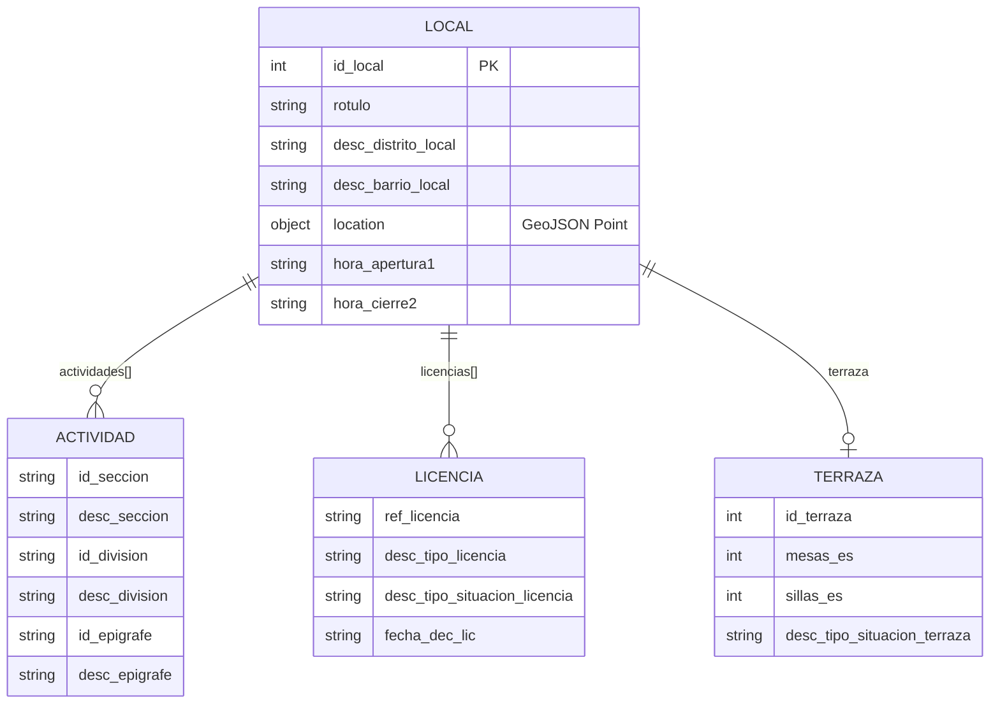
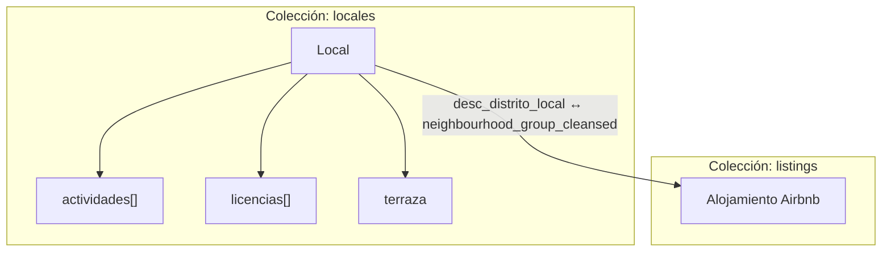
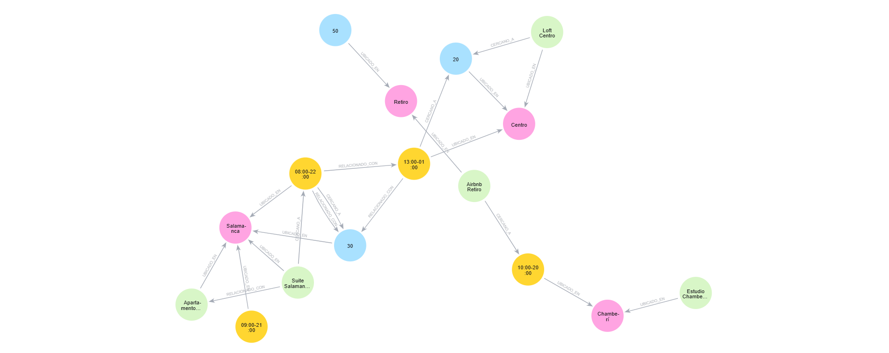

# Bases de Datos NoSQL. Entregable

---

## Orden de ejecución

1. `reto1__data_exploration_preparation_.ipynb` - Análisis, Limpieza, Modelado y Exportación de datos. Genera los ficheros procesados en `data/processed/`
2. `reto2__mongodb.ipynb` - Requiere MongoDB en `localhost:27017`
3. `reto3__neo4j.ipynb` - Requiere Neo4j en `localhost:7687`

---

## Reto 1 - Exploración inicial de los datos

### Descripción de los datasets

| Dataset | Registros | Descripción |
|---------|-----------|-------------|
| `locales202312.json` | 47,522 | Establecimientos comerciales de Madrid (dic. 2023) |
| `actividadeconomica202312.json` | 40,008 | Clasificación económica de los locales |
| `licencias202312.json` | 43,049 | Licencias urbanísticas de los locales |
| `terrazas202312.json` | 6,788 | Terrazas autorizadas asociadas a locales |
| `airbnb_listings.json` | 16,313 | Alojamientos Airbnb en Madrid |

> **Nota:** Toda la exploración (análisis, limpieza y procesamiento) se hizo con el 100% de los datos. La exportación para locales se tomó una muestra del 20% y para listings (alojamientos) el 100% de los datos. Estos ficheros ya procesados son los se importan a MongoDB como Colecciones.

### Hallazgos principales de la exploración

**Calidad de datos:**
- Los ficheros de locales, actividades, licencias y terrazas comparten el campo `id_local` como clave de integración.
- El campo `id_local` es válido en todos los ficheros salvo registros con valor `NULL` o `0` (eliminados en limpieza).
- Las licencias contienen 8 duplicados por clave primaria `(id_local, ref_licencia)`, resueltos conservando el registro más reciente (`fecha_dec_lic` más tardía).
- Las coordenadas de locales están en formato **UTM EPSG:25830** y requieren conversión a **WGS84 (lon, lat)** para compatibilidad con MongoDB GeoJSON.
- El dataset Airbnb tiene las coordenadas en orden incorrecto `[lat, lon]`; se corrige a `[lon, lat]`.

**Relaciones entre ficheros:**

```
locales (id_local) ←── actividades (id_local, id_epigrafe)
locales (id_local) ←── licencias   (id_local, ref_licencia)
locales (id_local) ←── terrazas    (id_local → id_terraza)
listings           ←── (sin FK directa con locales)
```

**Relación locales ↔ Airbnb:**
No existe clave foránea directa. La integración se realiza por el campo geográfico de distrito:
- Locales: `desc_distrito_local` (ej. "CENTRO", "SALAMANCA")
- Listings: `neighbourhood_group_cleansed` (ej. "Centro", "Salamanca")

Esta relación indirecta por distrito es suficiente para las consultas propuestas y para el modelo de grafo.

---

## Reto 2 - Modelado de datos en MongoDB

### Decisiones de diseño

#### Patrón adoptado: Documento Embebido (Embedded Document Pattern)

Se elige el patrón **embebido** por las siguientes razones:

1. **Cohesión de datos:** Las actividades, licencias y terraza de un local no tienen sentido fuera de ese contexto; se leen y consultan siempre juntos.
2. **Cardinalidad baja:** Un local típico tiene 1–3 actividades, 1–2 licencias y como máximo 1 terraza. No hay riesgo de documentos excesivamente grandes (sin riesgo de superar el límite de 16MB por documento).
3. **Rendimiento de lectura:** Permite recuperar toda la información de un establecimiento en una única operación, sin necesidad de lookups o joins.


#### Diagrama del modelo v1



### Colecciones en MongoDB

| Colección | Descripción | Volumetría | Documentos
|-----------|-------------|------------|-----------
| `locales` | Establecimientos con actividades, licencias y terraza embebidos | 27,402 | 20% |
| `listings` | Alojamientos Airbnb (colección independiente) | 16,313 | 100% |

### Consultas implementadas

#### a. Total de locales y terrazas por distrito y barrio

```python
pipeline_4a = [
    {
        "$group": {
            "_id": {
                "distrito": "$desc_distrito_local",
                "barrio":   "$desc_barrio_local"
            },
            "total_locales":  {"$sum": 1},
            "total_terrazas": {
                "$sum": {"$cond": [{"$ne": ["$terraza.id_terraza", None]}, 1, 0]}
            }
        }
    },
    {"$sort": {"total_locales": -1}},
    {"$limit": 10},
    {
        "$project": {
            "_id":            0,
            "distrito":       "$_id.distrito",
            "barrio":         "$_id.barrio",
            "total_locales":  1,
            "total_terrazas": 1
        }
    }
]
resultados_4a = list(col_locales.aggregate(pipeline_4a))
```

**Explicación:** Se agrupa por distrito y barrio. Muchos locales no tienen terrazas, pero en nuestro modelo embedido todos los locales tienen terraza, aunque todos sus valores estén a NULL, por eso que en la condición para sumar la terraza se añade que la `PK` no tiene que ser igual a None. Se añade un top de 10, para tener controlado el output de la query, y evitar que la consulta devuelva muchos de registros.

#### b. Tipos de licencia y cantidad por tipo

```python
pipeline_4b = [
    {"$unwind": {"path": "$licencias", "preserveNullAndEmptyArrays": False}},
    {
        "$group": {
            "_id":    "$licencias.desc_tipo_licencia",
            "cantidad": {"$sum": 1}
        }
    },
    {"$match": {"_id": {"$ne": None}}},
    {"$sort": {"cantidad": -1}},
    {"$project": {"_id": 0, "tipo_licencia": "$_id", "cantidad": 1}}
]
resultados_4b = list(col_locales.aggregate(pipeline_4b))
```

**Explicación:** `$unwind` desanida el array `licencias`. El `preserveNullAndEmptyArrays: false` excluye locales sin licencias. Se agrupa por tipo de licencia contando ocurrencias.

#### c. Locales con licencia "En trámite"

```python
import re
pipeline_4c = [
    {
        "$match": {
            "licencias.desc_tipo_situacion_licencia": {
                "$regex": re.compile(r"en\s+tr[aá]mit", re.IGNORECASE)
            }
        }
    },
    {"$unwind": "$licencias"},
    {
        "$match": {
            "licencias.desc_tipo_situacion_licencia": {
                "$regex": re.compile(r"en\s+tr[aá]mit", re.IGNORECASE)
            }
        }
    },
    {
        "$project": {
            "_id":             0,
            "id_local":        1,
            "rotulo":          1,
            "distrito":        "$desc_distrito_local",
            "barrio":          "$desc_barrio_local",
            "ref_licencia":    "$licencias.ref_licencia",
            "tipo_licencia":   "$licencias.desc_tipo_licencia",
            "estado_licencia": "$licencias.desc_tipo_situacion_licencia",
            "tiene_terraza":   {"$cond": [{"$ne": ["$terraza.id_terraza", None]}, True, False]}
        }
    },
    {"$limit": 10}
]
resultados_4c = list(col_locales.aggregate(pipeline_4c))
```

**Explicación:** Se usa `$regex` con flag `i` (case-insensitive) y patrón `tr[aá]mit` para capturar variantes con y sin tilde. El doble `$match` (antes y después de `$unwind`) optimiza el filtrado reduciendo documentos antes de desanidar.
> **Nota** Revisando los datos, la situación de la licencia viene como `En tramitación` y no en `En trámite`, como lo dice el enunciado.

#### d. Consulta por sección, división y epígrafe

```python
pipeline_4d_general = [
    {"$unwind": {"path": "$actividades", "preserveNullAndEmptyArrays": False}},
    
    {
        "$match": {
            "$and": [
                {"actividades.id_seccion": {"$ne": None}},
                {"actividades.id_division": {"$ne": None}},
                {"actividades.id_epigrafe": {"$ne": None}},
            ]
        }
    },
    
    {
        "$group": {
            "_id": {
                "seccion":   "$actividades.id_seccion",
                "desc_sec":  "$actividades.desc_seccion",
                "division":  "$actividades.id_division",
                "desc_div":  "$actividades.desc_division",
                "epigrafe":  "$actividades.id_epigrafe",
                "desc_epi":  "$actividades.desc_epigrafe"
            },
            "total_locales":  {"$sum": 1},
            "total_terrazas": {
                "$sum": {"$cond": [{"$ne": ["$terraza.id_terraza", None]}, 1, 0]}
            }
        }
    },
    
    {"$sort": {"total_locales": -1}},
    {"$limit": 10}
]
resultados_4d_general = list(col_locales.aggregate(pipeline_4d_general))
```

**Explicación:** Se usa `$unwind` para contar cada elemento del array de `actividades` como documento  y `$match` con `$and` para filtrar aquellas con sección, división o epígrafe nulos o vacíos. Finalmente, se utilizó `$group` para clasificar por estos tres campos, contabilizando los locales y terrazas reales.

#### e. Actividad económica más frecuente por barrio y distrito

```python
pipeline_4e = [
    {"$unwind": {"path": "$actividades", "preserveNullAndEmptyArrays": False}},
    
    {
        "$group": {
            "_id": {
                "distrito":  "$desc_distrito_local",
                "barrio":    "$desc_barrio_local",
                "actividad": "$actividades.desc_epigrafe"
            },
            "frecuencia": {"$sum": 1}
        }
    },

    {"$sort": {"frecuencia": -1}},
    
    {
        "$group": {
            "_id": {
                "distrito": "$_id.distrito",
                "barrio":   "$_id.barrio"
            },
            "actividad_predominante": {"$first": "$_id.actividad"},
            "frecuencia":             {"$first": "$frecuencia"}
        }
    },
    {"$sort": {"_id.distrito": 1, "_id.barrio": 1}},
    {"$limit": 10},
    {
        "$project": {
            "_id":                    0,
            "distrito":               "$_id.distrito",
            "barrio":                 "$_id.barrio",
            "actividad_predominante": 1,
            "frecuencia":             1
        }
    }
]
resultados_4e = list(col_locales.aggregate(pipeline_4e))
```

**Explicación:** La "doble agrupación" perimite: primero se agrupa por `(distrito, barrio, actividad)` para contar frecuencias, luego se ordena descendentemente y se aplica un segundo `$group` con `$first`, que tras el sort previo devuelve la actividad más frecuente de cada zona.

#### f. Actualización de horarios (criterio elegido: hostelería en barrio Cortes)

```python
resultado_update = col_locales.update_many(
    filter=filtro_4f,
    update={
        "$set": {
            "hora_apertura1": "13:00",
            "hora_cierre2":   "01:00"
        }
    }
)
```

**Criterio y justificación:** Se seleccionan los locales del barrio "San Andres" con actividad de hostelería (sección I). El criterio fue el barrio que tiene mas locales.

### Modelo v2 - Extensión con Airbnb

#### Decisión de modelado: colección independiente

Los alojamientos Airbnb se almacenan en una **colección separada** (`listings`) por las siguientes razones:

1. **Identidad propia:** Los alojamientos son entidades independientes (tienen `host_id`, `price`, `room_type`, `amenities`).
2. **Queries diferenciadas:** Las consultas sobre listings son distintas a las de locales (precio, habitaciones, reseñas).
3. **Relación por distrito:** La integración se realiza a nivel de consulta usando el campo común de distrito, no como subdocumento embebido.

#### Diagrama del modelo v2



---

## Reto 3 - Modelo de Grafo con Neo4j

### Diseño del modelo de grafo

#### Diagrama visual




### Nodos, etiquetas y atributos

#### Etiqueta `Barrio`
| Atributo | Tipo | Descripción |
|----------|------|-------------|
| `nombre` | string | Nombre del barrio (clave identificadora) |

#### Etiqueta `Local`
| Atributo | Tipo | Descripción |
|----------|------|-------------|
| `nombre` | string | Nombre o rótulo del establecimiento |
| `tipo_actividad` | string | Categoría económica (Restauración, Cultura, Salud…) |
| `horario` | string | Horario de apertura-cierre |
| `licencia` | string | Estado de la licencia (Concedida / En trámite) |

#### Etiqueta `Terraza`
| Atributo | Tipo | Descripción |
|----------|------|-------------|
| `nombre` | string | Nombre de la terraza |
| `capacidad` | int | Número de sillas/plazas |
| `estado_licencia` | string | Estado de la licencia de la terraza |

#### Etiqueta `Alojamiento`
| Atributo | Tipo | Descripción |
|----------|------|-------------|
| `nombre` | string | Nombre del alojamiento |
| `precio` | int | Precio por noche en euros |
| `numero_habitaciones` | int | Número de dormitorios (0 = estudio/loft) |
| `reseñas` | int | Número de reseñas de usuarios |
| `servicios` | array | Lista de servicios disponibles |

### Relaciones y atributos

#### `UBICADO_EN` (Local/Terraza/Alojamiento) → (Barrio)
| Atributo | Tipo | Descripción |
|----------|------|-------------|
| `distancia` | float | Distancia en km al centro del barrio |

**Uso:** Permite navegar desde cualquier entidad hasta su barrio de ubicación. Es la relación más fundamental del modelo, ya que conecta los tres tipos de entidades con su contexto geográfico.

#### `CERCANO_A` (cualquier entidad) → (cualquier entidad)
| Atributo | Tipo | Descripción |
|----------|------|-------------|
| `distancia` | float | Distancia en km entre las dos entidades |

**Uso:** Modela la proximidad física entre establecimientos y alojamientos. Especialmente útil para sistemas de recomendación ("locales cercanos a tu alojamiento") y análisis de densidad comercial.

#### `RELACIONADO_CON` (Local/Terraza/Alojamiento) → (cualquier entidad)
| Atributo | Tipo | Descripción |
|----------|------|-------------|
| `motivo` | string | Razón de la relación (categoría compartida, mismo barrio, etc.) |

**Uso:** Conecta entidades que comparten características comunes (mismo tipo de actividad, mismo rango de precio, misma zona). Facilita consultas de agrupación semántica.

---

