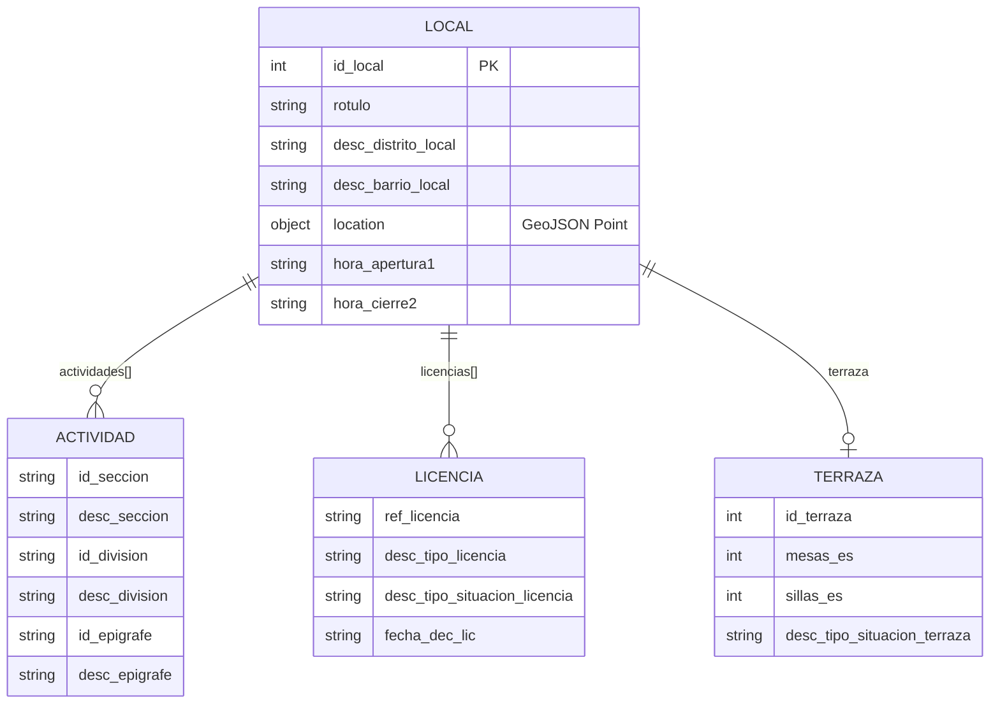
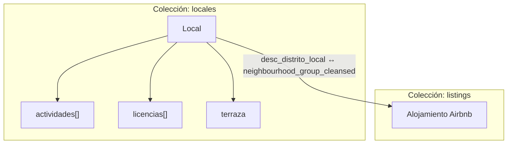
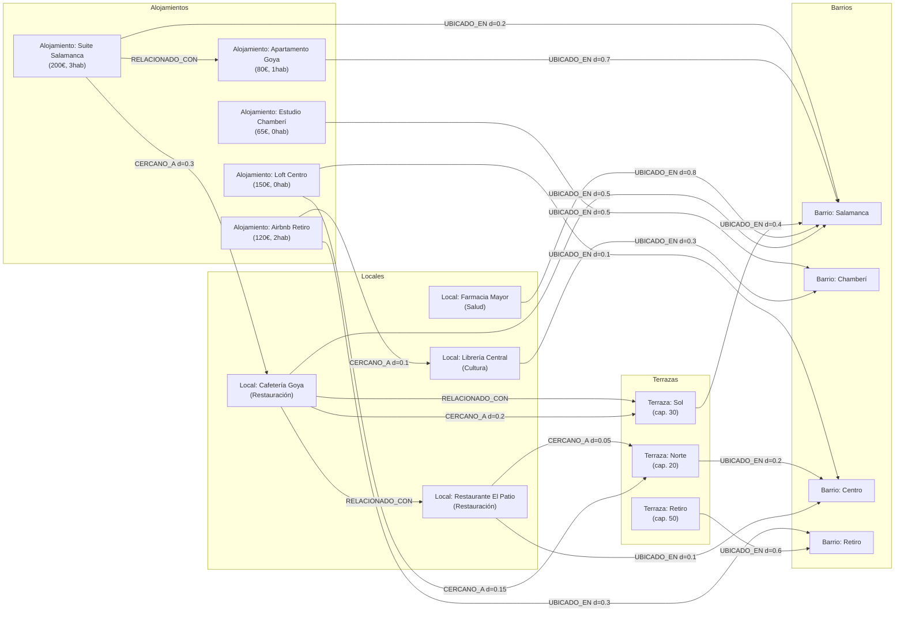

# Bases de Datos NoSQL — Entregable

**Máster NTIC — Universidad Complutense de Madrid**
**Módulo 5 — Uso de las Bases de Datos NoSQL**

---

## Estructura del proyecto

```
modelado_nosql/
├── actividad/
│   └── Actividad_Enunciado_BDNoSQL_UCM-NTIC.pdf
├── data/
│   ├── raw/                        # Datasets originales (no versionados)
│   │   ├── locales202312.json
│   │   ├── actividadeconomica202312.json
│   │   ├── licencias202312.json
│   │   ├── terrazas202312.json
│   │   └── airbnb_listings.json
│   └── processed/                  # Ficheros exportados para MongoDB (generados al ejecutar notebook 01)
│       ├── locales_mongodb.json
│       └── listings_mongodb.json
├── notebook/
│   ├── 01_data_preparation.ipynb   # Pipeline ETL completo
│   ├── 02_reto1_exploracion.ipynb  # Reto 1: Exploración inicial
│   ├── 03_reto2_modelado_mongodb.ipynb  # Reto 2: Modelado MongoDB
│   └── 04_reto3_grafo_neo4j.ipynb  # Reto 3: Modelo de grafo Neo4j
└── README.md                       # Este fichero
```

---

## Orden de ejecución

1. `01_data_preparation.ipynb` — Genera los ficheros procesados en `data/processed/`
2. `02_reto1_exploracion.ipynb` — Exploración y análisis de calidad de datos
3. `03_reto2_modelado_mongodb.ipynb` — Requiere MongoDB en `localhost:27017`
4. `04_reto3_grafo_neo4j.ipynb` — Requiere Neo4j en `localhost:7687`

---

## Reto 1 — Exploración inicial de los datos

### Descripción de los datasets

| Dataset | Registros | Descripción |
|---------|-----------|-------------|
| `locales202312.json` | 47,522 | Establecimientos comerciales de Madrid (dic. 2023) |
| `actividadeconomica202312.json` | 40,008 | Clasificación económica de los locales (IAE) |
| `licencias202312.json` | 43,049 | Licencias urbanísticas de los locales |
| `terrazas202312.json` | 6,788 | Terrazas autorizadas asociadas a locales |
| `airbnb_listings.json` | 16,313 | Alojamientos Airbnb en Madrid |

### Hallazgos principales de la exploración

**Calidad de datos:**
- Los ficheros de locales, actividades, licencias y terrazas comparten el campo `id_local` como clave de integración.
- El campo `id_local` es válido en todos los ficheros salvo registros con valor `NULL` o `0` (eliminados en limpieza).
- Las licencias contienen 8 duplicados por clave primaria `(id_local, ref_licencia)`, resueltos conservando el registro más reciente (`fecha_dec_lic` más tardía).
- Los campos `hora_apertura1` y `hora_cierre2` presentan alta tasa de valores nulos (~60%), lo que refleja que muchos establecimientos no reportan horario.
- Las coordenadas de locales están en formato **UTM EPSG:25830** y requieren conversión a **WGS84 (lon, lat)** para compatibilidad con MongoDB GeoJSON.
- El dataset Airbnb tiene las coordenadas en orden incorrecto `[lat, lon]`; se corrige a `[lon, lat]`.

**Relaciones entre ficheros:**

```
locales (id_local) ←── actividades (id_local, id_epigrafe)
locales (id_local) ←── licencias   (id_local, ref_licencia)
locales (id_local) ←── terrazas    (id_local → id_terraza)
listings           ←── (sin FK directa con locales)
```

**Relación locales ↔ Airbnb:**
No existe clave foránea directa. La integración se realiza por el campo geográfico de distrito:
- Locales: `desc_distrito_local` (ej. "CENTRO", "SALAMANCA")
- Listings: `neighbourhood_group_cleansed` (ej. "Centro", "Salamanca")

Esta relación indirecta por distrito es suficiente para las consultas propuestas y para el modelo de grafo.

---

## Reto 2 — Modelado de datos en MongoDB

### Decisiones de diseño

#### Patrón adoptado: Documento Embebido (Embedded Document Pattern)

Se elige el patrón **embebido** por las siguientes razones:

1. **Cohesión de datos:** Las actividades, licencias y terraza de un local no tienen sentido fuera de ese contexto; se leen y consultan siempre juntos.
2. **Cardinalidad baja:** Un local típico tiene 1–3 actividades, 1–2 licencias y como máximo 1 terraza. No hay riesgo de documentos excesivamente grandes.
3. **Rendimiento de lectura:** Permite recuperar toda la información de un establecimiento en una única operación, sin necesidad de lookups o joins.
4. **Alineación con patrones NoSQL:** El patrón embebido es la recomendación de MongoDB para relaciones de tipo "one-to-few" con alta cohesión.

#### Estructura del documento (modelo v1)

```json
{
  "_id": ObjectId("..."),
  "id_local": 12345,
  "rotulo": "Cafetería Ejemplo",
  "desc_distrito_local": "CENTRO",
  "desc_barrio_local": "SOL",
  "location": {
    "type": "Point",
    "coordinates": [-3.703, 40.416]
  },
  "hora_apertura1": "08:00",
  "hora_cierre2": "22:00",
  "actividades": [
    {
      "id_seccion": "I",
      "desc_seccion": "HOSTELERIA Y RESTAURANTES",
      "id_division": "55",
      "desc_division": "RESTAURANTES Y CAFES",
      "id_epigrafe": "672",
      "desc_epigrafe": "CAFES Y BARES"
    }
  ],
  "licencias": [
    {
      "ref_licencia": "2023/12345",
      "desc_tipo_licencia": "LICENCIA DE APERTURA",
      "desc_tipo_situacion_licencia": "Concedida",
      "fecha_dec_lic": "2023-01-15"
    }
  ],
  "terraza": {
    "id_terraza": 9876,
    "mesas_es": 6,
    "sillas_es": 24,
    "desc_tipo_situacion_terraza": "Autorizada",
    "hora_ini_LJ_es": "10:00",
    "hora_fin_LJ_es": "22:00"
  }
}
```

#### Diagrama del modelo v1



### Colecciones en MongoDB

| Colección | Descripción | Documentos (muestra 20%) |
|-----------|-------------|--------------------------|
| `locales` | Establecimientos con actividades, licencias y terraza embebidos | ~9,500 |
| `listings` | Alojamientos Airbnb (colección independiente) | 16,313 |

### Consultas implementadas

#### a. Total de locales y terrazas por distrito y barrio

```javascript
db.locales.aggregate([
  {
    $group: {
      _id: { distrito: "$desc_distrito_local", barrio: "$desc_barrio_local" },
      total_locales:  { $sum: 1 },
      total_terrazas: { $sum: { $cond: [{ $ifNull: ["$terraza", false] }, 1, 0] } }
    }
  },
  { $sort: { total_locales: -1 } }
])
```

**Explicación:** Se agrupa por distrito y barrio. Para contar terrazas se usa `$ifNull` que devuelve `true` si el campo `terraza` existe y no es nulo (campo embebido), sumando 1 en ese caso.

#### b. Tipos de licencia y cantidad por tipo

```javascript
db.locales.aggregate([
  { $unwind: { path: "$licencias", preserveNullAndEmptyArrays: false } },
  {
    $group: {
      _id: "$licencias.desc_tipo_licencia",
      cantidad: { $sum: 1 }
    }
  },
  { $match: { _id: { $ne: null } } },
  { $sort: { cantidad: -1 } }
])
```

**Explicación:** `$unwind` desanida el array `licencias`. El `preserveNullAndEmptyArrays: false` excluye locales sin licencias. Se agrupa por tipo de licencia contando ocurrencias.

#### c. Locales con licencia "En trámite"

```javascript
db.locales.aggregate([
  {
    $match: {
      "licencias.desc_tipo_situacion_licencia": {
        $regex: /en\s+tr[aá]mite/i
      }
    }
  },
  { $unwind: "$licencias" },
  {
    $match: {
      "licencias.desc_tipo_situacion_licencia": { $regex: /en\s+tr[aá]mite/i }
    }
  },
  {
    $project: {
      id_local: 1, rotulo: 1,
      distrito: "$desc_distrito_local",
      barrio:   "$desc_barrio_local",
      ref_licencia:    "$licencias.ref_licencia",
      tipo_licencia:   "$licencias.desc_tipo_licencia",
      estado_licencia: "$licencias.desc_tipo_situacion_licencia",
      tiene_terraza:   { $cond: [{ $ifNull: ["$terraza", false] }, true, false] }
    }
  }
])
```

**Explicación:** Se usa `$regex` con flag `i` (case-insensitive) y patrón `tr[aá]mite` para capturar variantes con y sin tilde. El doble `$match` (antes y después de `$unwind`) optimiza el filtrado reduciendo documentos antes de desanidar.

#### d. Consulta por sección, división y epígrafe

```javascript
db.locales.aggregate([
  {
    $match: {
      actividades: {
        $elemMatch: {
          $and: [
            { id_seccion: "I" },
            { id_division: "55" }
          ]
        }
      }
    }
  },
  { $unwind: "$actividades" },
  {
    $match: { "actividades.id_seccion": "I", "actividades.id_division": "55" }
  },
  {
    $group: {
      _id: {
        seccion: "$actividades.id_seccion",
        division: "$actividades.id_division",
        epigrafe: "$actividades.id_epigrafe",
        desc_epi: "$actividades.desc_epigrafe"
      },
      total: { $sum: 1 }
    }
  },
  { $sort: { total: -1 } }
])
```

**Explicación:** `$elemMatch` busca documentos donde al menos un elemento del array `actividades` cumpla las condiciones simultáneamente. Permite combinar filtros de sección, división y epígrafe de forma precisa.

#### e. Actividad económica más frecuente por barrio y distrito

```javascript
db.locales.aggregate([
  { $unwind: { path: "$actividades", preserveNullAndEmptyArrays: false } },
  {
    $group: {
      _id: {
        distrito: "$desc_distrito_local",
        barrio:   "$desc_barrio_local",
        actividad: "$actividades.desc_epigrafe"
      },
      frecuencia: { $sum: 1 }
    }
  },
  { $sort: { frecuencia: -1 } },
  {
    $group: {
      _id: { distrito: "$_id.distrito", barrio: "$_id.barrio" },
      actividad_predominante: { $first: "$_id.actividad" },
      frecuencia: { $first: "$frecuencia" }
    }
  },
  { $sort: { "_id.distrito": 1, "_id.barrio": 1 } }
])
```

**Explicación:** La estrategia de "doble agrupación" es clave: primero se agrupa por `(distrito, barrio, actividad)` para contar frecuencias, luego se ordena descendentemente y se aplica un segundo `$group` con `$first`, que tras el sort previo devuelve la actividad más frecuente de cada zona.

#### f. Actualización de horarios (criterio elegido: hostelería en barrio Cortes)

```javascript
db.locales.updateMany(
  {
    desc_barrio_local: { $regex: /cortes/i },
    "actividades.id_seccion": "I"
  },
  {
    $set: {
      hora_apertura1: "13:00",
      hora_cierre2:   "01:00"
    }
  }
)
```

**Criterio y justificación:** Se seleccionan los locales del barrio "Cortes" (distrito Centro) con actividad de hostelería (sección I del IAE). Este criterio es geográfico y comercial: el barrio de las Cortes es una zona céntrica con alta concentración de restauración, y el horario 13:00–01:00 responde a un patrón realista de apertura en tarde/noche para establecimientos hosteleros del centro histórico. Simula una actualización normativa de horarios.

### Índices creados y análisis de rendimiento

#### a. Índice simple sobre `desc_barrio_local`

```javascript
db.locales.createIndex({ desc_barrio_local: 1 }, { name: "idx_barrio" })
```

| Métrica | Sin índice | Con índice |
|---------|-----------|------------|
| Stage | COLLSCAN | IXSCAN |
| Docs examinados | ~9,500 (muestra 20%) | Solo docs del barrio |
| Mejora | Requiere escanear toda la colección | Salta directamente a entradas del barrio |

**Análisis:** El índice simple convierte una búsqueda por barrio de O(n) a O(log n). La mejora es especialmente notable cuando el barrio buscado representa una fracción pequeña de la colección total.

#### b. Índice compuesto sobre `desc_distrito_local` + `desc_barrio_local`

```javascript
db.locales.createIndex(
  { desc_distrito_local: 1, desc_barrio_local: 1 },
  { name: "idx_distrito_barrio" }
)
```

**Análisis:** El orden de los campos sigue la regla del prefijo más selectivo a menos selectivo. Las consultas que filtran solo por distrito también aprovechan este índice (prefijo izquierdo). Las que filtran solo por barrio deberían usar el índice simple. El índice compuesto es ideal para las consultas de agregación por `(distrito, barrio)` como las del apartado 4a.

#### c. Índice de array sobre `actividades.desc_epigrafe`

```javascript
db.locales.createIndex(
  { "actividades.desc_epigrafe": 1 },
  { name: "idx_actividades_epigrafe" }
)
```

**Análisis:** MongoDB crea automáticamente un índice multikey cuando el campo indexado es un array. Esto permite buscar documentos que contengan un epígrafe específico de forma eficiente, sin necesidad de desanidar el array. Fundamental para las consultas del apartado 4d.

### Modelo v2 — Extensión con Airbnb

#### Decisión de modelado: colección independiente

Los alojamientos Airbnb se almacenan en una **colección separada** (`listings`) por las siguientes razones:

1. **Identidad propia:** Los alojamientos son entidades independientes (tienen `host_id`, `price`, `room_type`, `amenities`).
2. **Volumen independiente:** 16,313 listings vs ~9,500 locales (muestra 20%) — no hay correspondencia 1:1.
3. **Queries diferenciadas:** Las consultas sobre listings son distintas a las de locales (precio, habitaciones, reseñas).
4. **Relación por distrito:** La integración se realiza a nivel de consulta usando el campo común de distrito, no como subdocumento embebido.

#### Diagrama del modelo v2



---

## Reto 3 — Modelo de Grafo con Neo4j

### Diseño del modelo de grafo

#### Diagrama visual



### Nodos, etiquetas y atributos

#### Etiqueta `Barrio`
| Atributo | Tipo | Descripción |
|----------|------|-------------|
| `nombre` | string | Nombre del barrio (clave identificadora) |

#### Etiqueta `Local`
| Atributo | Tipo | Descripción |
|----------|------|-------------|
| `nombre` | string | Nombre o rótulo del establecimiento |
| `tipo_actividad` | string | Categoría económica (Restauración, Cultura, Salud…) |
| `horario` | string | Horario de apertura-cierre |
| `licencia` | string | Estado de la licencia (Concedida / En trámite) |

#### Etiqueta `Terraza`
| Atributo | Tipo | Descripción |
|----------|------|-------------|
| `nombre` | string | Nombre de la terraza |
| `capacidad` | int | Número de sillas/plazas |
| `estado_licencia` | string | Estado de la licencia de la terraza |

#### Etiqueta `Alojamiento`
| Atributo | Tipo | Descripción |
|----------|------|-------------|
| `nombre` | string | Nombre del alojamiento |
| `precio` | int | Precio por noche en euros |
| `numero_habitaciones` | int | Número de dormitorios (0 = estudio/loft) |
| `reseñas` | int | Número de reseñas de usuarios |
| `servicios` | array | Lista de servicios disponibles |

### Relaciones y atributos

#### `UBICADO_EN` (Local/Terraza/Alojamiento) → (Barrio)
| Atributo | Tipo | Descripción |
|----------|------|-------------|
| `distancia` | float | Distancia en km al centro del barrio |

**Uso:** Permite navegar desde cualquier entidad hasta su barrio de ubicación. Es la relación más fundamental del modelo, ya que conecta los tres tipos de entidades con su contexto geográfico.

#### `CERCANO_A` (cualquier entidad) → (cualquier entidad)
| Atributo | Tipo | Descripción |
|----------|------|-------------|
| `distancia` | float | Distancia en km entre las dos entidades |

**Uso:** Modela la proximidad física entre establecimientos y alojamientos. Especialmente útil para sistemas de recomendación ("locales cercanos a tu alojamiento") y análisis de densidad comercial.

#### `RELACIONADO_CON` (Local/Terraza/Alojamiento) → (cualquier entidad)
| Atributo | Tipo | Descripción |
|----------|------|-------------|
| `motivo` | string | Razón de la relación (categoría compartida, mismo barrio, etc.) |

**Uso:** Conecta entidades que comparten características comunes (mismo tipo de actividad, mismo rango de precio, misma zona). Facilita consultas de agrupación semántica.

### Consultas Cypher implementadas

#### Consulta 2.1: Locales y terrazas del barrio "Salamanca"

```cypher
MATCH (b:Barrio {nombre: "Salamanca"})<-[:UBICADO_EN]-(n)
WHERE n:Local OR n:Terraza
RETURN n.nombre AS nombre, labels(n)[0] AS tipo
ORDER BY tipo, nombre
```

**Explicación:** La dirección inversa `<-[:UBICADO_EN]-` navega desde el barrio hacia todas las entidades ubicadas en él. El filtro `WHERE n:Local OR n:Terraza` acota el resultado excluyendo alojamientos. La clave del grafo es que esta consulta es O(grado del nodo Barrio), no O(n) como en una colección documental.

#### Consulta 2.2: Alojamientos con precio > 100€

```cypher
MATCH (a:Alojamiento)
WHERE a.precio > 100
RETURN a.nombre AS nombre, a.precio AS precio
ORDER BY a.precio DESC
```

**Explicación:** Filtro directo sobre atributo de nodo. En Neo4j se pueden crear índices sobre atributos de nodos (`CREATE INDEX FOR (a:Alojamiento) ON (a.precio)`) para acelerar este tipo de consultas de rango.

#### Consulta 2.3: Barrios con alojamientos sin dormitorios

```cypher
MATCH (a:Alojamiento)-[:UBICADO_EN]->(b:Barrio)
WHERE a.numero_habitaciones = 0
RETURN b.nombre AS barrio, COUNT(a) AS total_alojamientos
ORDER BY total_alojamientos DESC
```

**Explicación:** La traversal `(a)-[:UBICADO_EN]->(b)` navega desde los alojamientos hacia sus barrios. El filtro sobre `numero_habitaciones = 0` identifica estudios y lofts. `COUNT(a)` agrega por barrio destino.

#### Consulta 2.4: Barrios con alojamientos sin reseñas

```cypher
MATCH (a:Alojamiento)-[:UBICADO_EN]->(b:Barrio)
WHERE a.reseñas = 0
RETURN b.nombre AS barrio, COUNT(a) AS total_alojamientos
ORDER BY total_alojamientos DESC
```

**Explicación:** Mismo patrón que 2.3 pero filtrando por `reseñas = 0`. Identifica alojamientos recién publicados o sin actividad. Útil para análisis de madurez del mercado de alojamiento por zona.

### Ventajas del modelo de grafo frente al modelo documental

| Aspecto | MongoDB (documentos) | Neo4j (grafo) |
|---------|---------------------|---------------|
| Consulta por barrio | `$match` + scan | Navegación directa por relación `UBICADO_EN` |
| Proximidad entre entidades | Requiere cálculo geoespacial | Relación `CERCANO_A` precomputada |
| Análisis de conectividad | Aggregation pipeline complejo | Traversals nativos con profundidad variable |
| Recomendaciones | Múltiples pipelines | Path finding algorithms (shortestPath, etc.) |
| Relaciones entre pares | Costoso con lookups | O(grado del nodo) |

**Conclusión:** El modelo de grafo es complementario al modelo documental. MongoDB es óptimo para almacenar y consultar documentos ricos con subdocumentos embebidos; Neo4j es óptimo para navegar relaciones y analizar la estructura de conexiones entre entidades urbanas.

---

## Requisitos de entorno

### MongoDB
```bash
# Docker
docker run -d -p 27017:27017 --name mongo mongo:7

# Python
pip install pymongo
```

### Neo4j
```bash
# Docker
docker run -d -p 7474:7474 -p 7687:7687 \
  --env NEO4J_AUTH=neo4j/password \
  neo4j:5

# Python
pip install neo4j
```

### Dependencias Python completas
```bash
pip install duckdb pandas pyproj pymongo neo4j seaborn matplotlib
```

O con Poetry (configuración incluida en `pyproject.toml`):
```bash
poetry install
```
